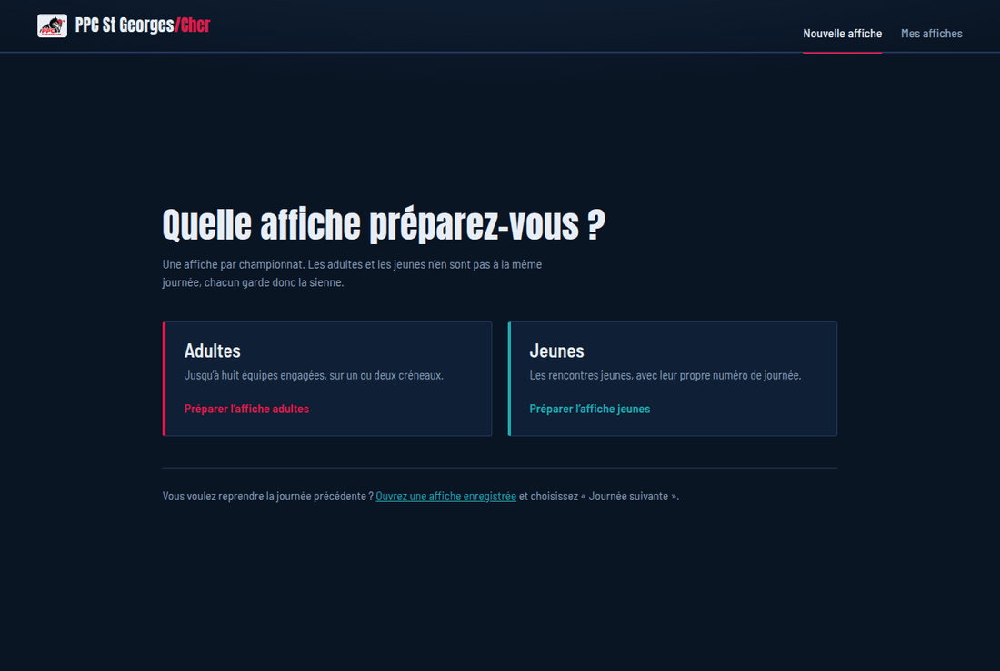
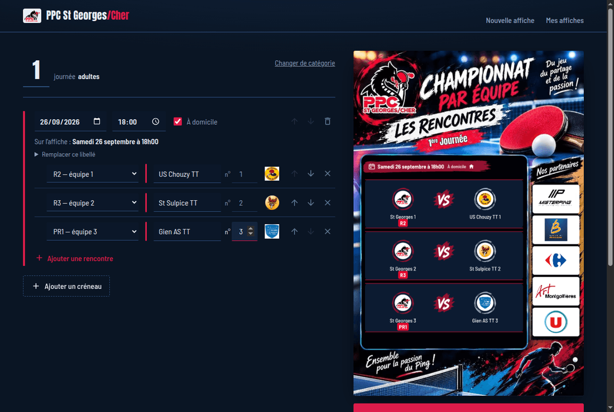
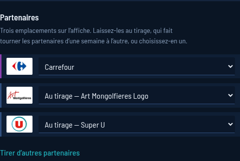
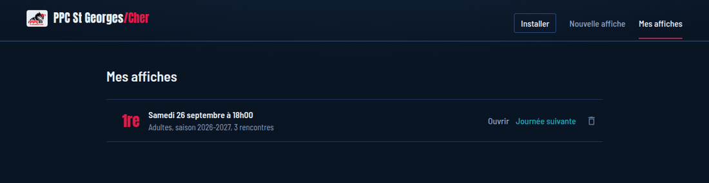

# Préparer l'affiche des rencontres

Ce guide explique comment fabriquer l'affiche que le club publie chaque semaine sur Facebook.
Comptez cinq minutes la première fois, deux les suivantes.

**L'application est ici : [julienb37.github.io/ppc_st_georges](https://julienb37.github.io/ppc_st_georges/)**

Il n'y a pas de compte à créer et rien à installer pour commencer. Vos affiches restent sur votre
appareil : elles ne partent sur aucun serveur.

---

## 1. Choisir le championnat



**Une affiche par championnat.** Les adultes et les jeunes n'en sont pas à la même journée, donc
chacun garde la sienne. Choisissez celui que vous préparez ; vous ferez la seconde affiche
séparément, de la même façon.

---

## 2. Remplir la journée



L'affiche se dessine **à droite, à chaque frappe**. Ce que vous voyez est exactement ce que vous
obtiendrez dans le fichier : il n'y a pas de surprise à l'enregistrement.

**Le grand chiffre en haut à gauche est le numéro de journée.** Cliquez-le et tapez le bon numéro.

Ensuite, pour chaque créneau :

| Champ              | Ce qu'il faut savoir                                                                                                             |
| ------------------ | -------------------------------------------------------------------------------------------------------------------------------- |
| **Date et heure**  | La phrase imprimée sur l'affiche est calculée pour vous et s'affiche juste en dessous, sous « Sur l'affiche »                    |
| **À domicile**     | La case change le libellé et la couleur du créneau. Décochée, elle affiche « À l'extérieur »                                     |
| **Notre équipe**   | Une seule liste donne la division et le numéro d'équipe : « R2 — équipe 1 »                                                      |
| **Équipe adverse** | Tapez les premières lettres, la liste propose les clubs connus **avec leur logo**. Choisissez-en un pour que le logo soit repris |
| **n°**             | Le numéro de l'équipe adverse, quand il y en a un. Laissez **0** pour n'afficher que le nom du club                              |

**Plusieurs créneaux.** Si toutes les équipes ne jouent pas au même moment, cliquez
« Ajouter un créneau ». Chaque créneau reçoit sa propre couleur sur l'affiche.

> **Le samedi n'est pas le bon jour ?** Dépliez « Remplacer ce libellé » pour écrire la date à la
> main. À n'utiliser qu'en dernier recours : le texte calculé est juste, et une date écrite à la
> main ne se corrige pas toute seule si la rencontre est décalée.

### Si l'application refuse d'enregistrer

Un encadré liste ce qui manque, en désignant l'endroit : « créneau 1 — La date ou l'heure manque. »
Le bouton d'enregistrement reste inactif tant que la liste n'est pas vide. Une affiche incomplète
ne peut pas être publiée par accident.

---

## 3. Les partenaires



L'affiche porte cinq partenaires. Les **deux premiers sont fixes** et n'apparaissent pas dans la
liste : ce sont des engagements du club.

Les **trois autres se choisissent**, ou se laissent au tirage. Laissés au tirage, ils tournent
d'une semaine à l'autre pour que tous les commerçants passent à peu près aussi souvent — c'est le
réglage à garder en temps normal.

- Pour **imposer** un partenaire, choisissez-le dans sa liste. Un trait violet apparaît à gauche :
  l'emplacement est retenu et le tirage n'y touchera plus.
- Pour le **rendre au tirage**, rechoisissez « Au tirage ».
- **« Tirer d'autres partenaires »** relance le tirage sur les seuls emplacements laissés libres.

---

## 4. Enregistrer l'affiche

Cliquez **« Enregistrer l'affiche »**. Votre navigateur vous demande où ranger le fichier, dont le
nom est déjà rempli :

```
journee-01-adultes-2026-2027.png
```

C'est cette image que vous publiez sur Facebook.

---

## 5. La semaine suivante



Chaque affiche est enregistrée **automatiquement** dès qu'elle est complète : il n'y a pas de
bouton « sauvegarder ». Vous les retrouvez toutes sous **« Mes affiches »**.

C'est là que se gagne le temps de la semaine suivante : **« Journée suivante »** reprend l'affiche,
avance le numéro de journée d'un cran et les dates d'une semaine. Il ne vous reste que les
adversaires à changer.

---

## Installer l'application

L'installation n'est pas obligatoire, mais elle vaut le détour : l'application s'ouvre alors depuis
l'écran d'accueil comme n'importe quelle autre, et **fonctionne sans connexion**. Pratique en
salle.

- **Android** — un bouton **« Installer »** apparaît en haut à droite quand votre navigateur le
  propose. S'il n'est pas là, ouvrez le menu **⋮** et choisissez « Installer l'application ».
- **iPhone et iPad** — Safari ne propose pas de bouton. Utilisez **Partager** (le carré avec une
  flèche), puis **« Sur l'écran d'accueil »**.
- **Ordinateur** — Chrome et Edge affichent le même bouton « Installer ».

Une fois installée, l'application garde tout ce dont elle a besoin pour dessiner : polices, gabarit
et logos. Vous pouvez préparer une affiche entière sans réseau.

---

## Questions courantes

**Un club n'a pas de logo.** L'affiche pose alors ses initiales dans le rond. Il n'est pas encore
possible d'ajouter un logo depuis l'application : signalez le club manquant.

**Un nom d'équipe est trop long.** Un message le signale sous l'affiche. L'application réduit le
texte autant qu'elle s'y autorise, mais **elle ne descend pas en dessous d'une taille lisible** :
au-delà, le nom mord sur son voisin. C'est donc un avertissement à prendre au sérieux — regardez
l'aperçu, et raccourcissez le nom dans le champ si le résultat ne va pas.

**Un bandeau annonce une nouvelle version.** Cliquez « Recharger » : l'application est mise à jour.
Faites-le quand vous n'êtes pas au milieu d'une saisie.

**L'application ne se charge plus correctement.** Un bandeau propose
« Réinitialiser l'application ». C'est sans danger : cela vide ce que l'application garde en
mémoire pour fonctionner hors ligne, **vos affiches enregistrées ne sont pas touchées**.

**Vos affiches sont sur cet appareil, et seulement là.** Elles ne se retrouvent pas sur votre
téléphone si vous les avez créées sur l'ordinateur, et vider les données du navigateur les
supprime. Pensez à enregistrer les images importantes ailleurs.
